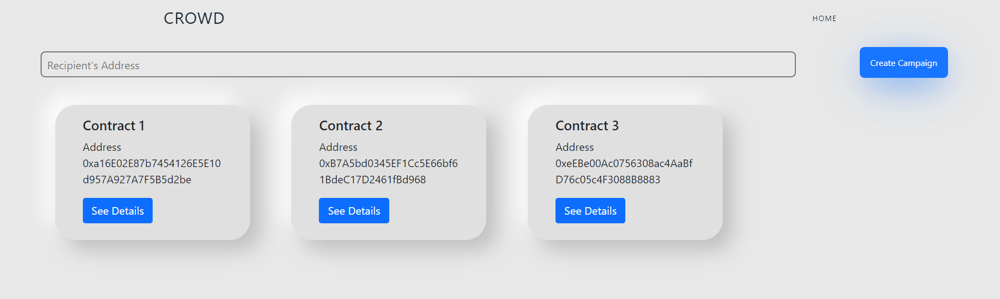
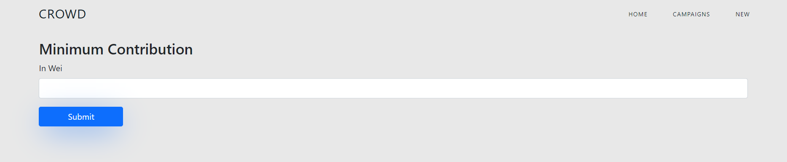
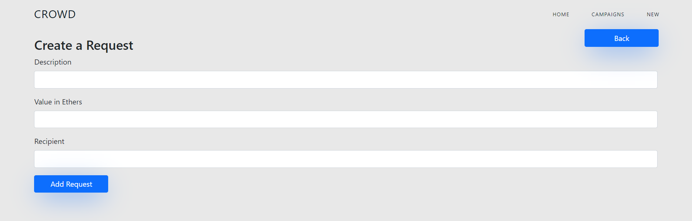
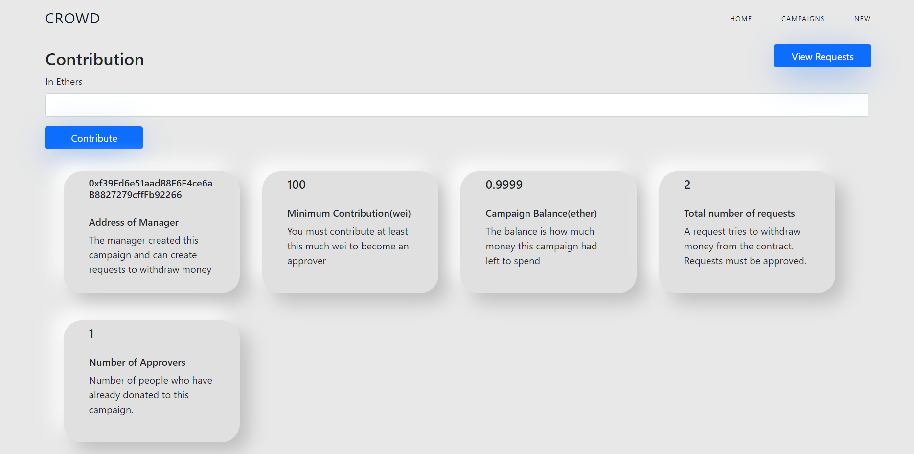
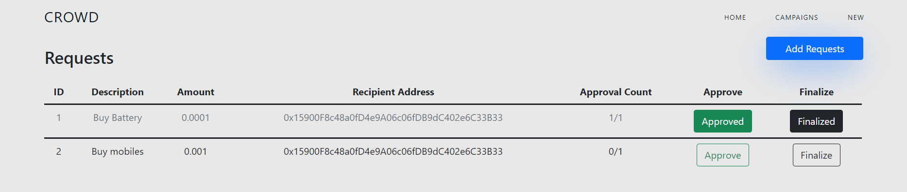

# CrowDe

A functional approach to create a decentralized clone of the website [Kickstarter](https://www.kickstarter.com). Backend is written in Solidity `version 0.8.0` and deployed using Hardhat and frontend is designed using React.

## Local Installation & Set Up

1.  Ensure [nvm](https://github.com/nvm-sh/nvm) and [npm](https://www.npmjs.com/) are installed globally

2.  Install the correct version of Node

    ```shell
    nvm install
    ```

3.  Install dependencies

    ```shell
    npm install
    ```

4.  Compile your Solidity code using `npx hardhat compile`

5.  Run your script file using `npx hardhat run ---your network environment your script file path`

6.  Run the React app on <http://localhost:3000>

    ```shell
    npm start
    ```

## Home Page

<p align="center">
  
</p>

## Create Campaign Page

<p align="center">
  
</p>

## Add Requests Page

<p align="center">
  
</p>

## Campaign Details Page

<p align="center">
  
</p>

## Requests Page

<p align="center">
  
</p>
